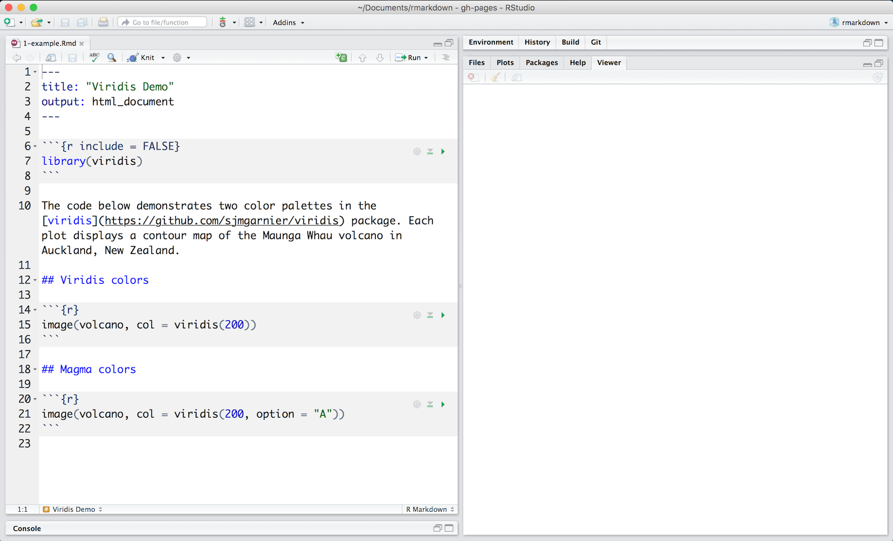

# Introducción
R Markdown proporciona un marco de creación para la ciencia de datos. Puede usar un solo archivo R Markdown para guardar, ejecutar código y generar informes de alta calidad que se puedan compartir con una audiencia.

Los documentos de R Markdown son completamente reproducibles y admiten docenas de formatos de salida estáticos y dinámicos.


Como el resto de R, R Markdown es gratuito y de código abierto. Puede instalar el paquete R Markdown de CRAN con:


```
install.packages("rmarkdown")
```

# ¿Cómo funciona?

Este es un archivo R Markdown, un archivo de texto sin formato que tiene la extensión .Rmd

El archivo contiene tres tipos de contenido:

* Un encabezado YAML (opcional) rodeado por --- s
* Fragmentos de código R rodeados por `` s
* texto mezclado con formato de texto simple


{width=1000}


Uno puede ejecutar cada fragmento de código haciendo clic en el icono verde. RStudio ejecuta el código y muestra los resultados en línea con su archivo.


# Salida de renderizado
Para generar un informe a partir del archivo, hay que ejecutar el siguiente codigo:

```
library(rmarkdown)
render("1-example.Rmd")
```

No obstante, es mejor usar el botón "Tejer" ("knit") en el IDE de RStudio para renderizar el archivo y obtener una vista previa de la salida con un solo clic.

{width=1000}

R Markdown genera un nuevo archivo que contiene texto, código y resultados seleccionados del archivo .Rmd. El nuevo archivo puede ser una página web terminada, PDF, documento de MS Word, presentación de diapositivas, cuaderno, folleto, libro, tablero, viñeta de paquete u otro formato.

# ¿Cómo funciona?

{width=1000}


Cuando ejecuta render, R Markdown alimenta el archivo .Rmd a knitr, que ejecuta todos los fragmentos de código y crea un nuevo documento de rebajas (.md) que incluye el código y su salida.

El archivo de rebajas generado por knitr es luego procesado por pandoc, que es responsable de crear el formato terminado.

Esto puede parecer complicado, pero R Markdown lo hace extremadamente simple al encapsular todo el procesamiento anterior en una única función de renderizado.

# Code Chunks

Es la sección donde se puede programar. Puede insertar rápidamente fragmentos como estos en su archivo con:

* el atajo de teclado Ctrl + Alt + I (OS X: Cmd + Opción + I)
* el comando Agregar fragmento en la barra de herramientas del editor
* o escribiendo los delimitadores de fragmentos ` `` {r} y ` ``.

Cuando renderice su archivo .Rmd, R Markdown ejecutará cada fragmento de código e incrustará los resultados debajo del fragmento de código en su informe final.

## Chunk options

La salida de fragmentos se puede personalizar con las opciones de knitr, argumentos establecidos en el {} de un encabezado de fragmentos. Arriba, usamos cinco argumentos:

* _include = FALSE_ evita que el código y los resultados aparezcan en el archivo terminado. R Markdown aún ejecuta el código en el fragmento y los resultados pueden ser utilizados por otros fragmentos.
* _echo = FALSE_ evita que el código, pero no los resultados, aparezcan en el archivo terminado. Esta es una forma útil de incrustar figuras.
* _message = FALSE_ evita que los mensajes generados por el código aparezcan en el archivo terminado.
* _warning = FALSE_ evita que las advertencias generadas por el código aparezcan en el final.
fig.cap = "..." agrega un título a los resultados gráficos.

## Global options

Para establecer opciones globales que se apliquen a cada fragmento de su archivo, llame a knitr :: opts_chunk $ set en un fragmento de código. Knitr tratará cada opción que pase a knitr :: opts_chunk $ set como un valor predeterminado global que se puede sobrescribir en encabezados de fragmentos individuales.

## Lenguajes admitidos

knitr puede ejecutar código en muchos lenguajes además de R. Algunos de los motores de lenguaje disponibles incluyen:

* Python
* SQL
* Bash
* Rcpp
* Stan
* JavaScript
* CSS

Para procesar un fragmento de código utilizando un motor de idioma alternativo, reemplace la r al comienzo de su declaración de fragmento con el nombre del idioma:

```
```{bash}
```
```

# Tablas

De forma predeterminada, R Markdown muestra los marcos de datos y las matrices como estarían en el terminal R (en una fuente monoespaciada). Si prefiere que los datos se muestren con formato adicional, puede usar la función knitr :: kable o utilizar el paquete gt.

{width=1000}


```
install.packages("gt")
```
Para ver en detalle como se utiliza este paquete recomiendo el siguiente link: https://gt.rstudio.com/articles/intro-creating-gt-tables.html

# Sintaxis básica

{width=1000}
{width=1000}

