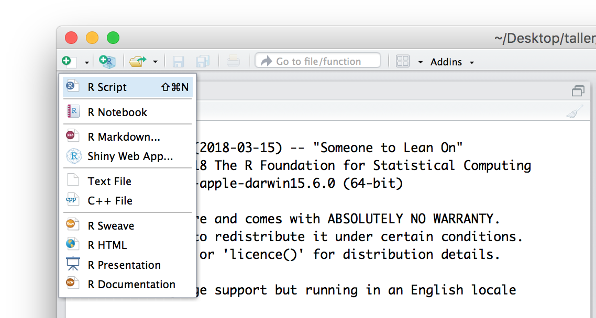
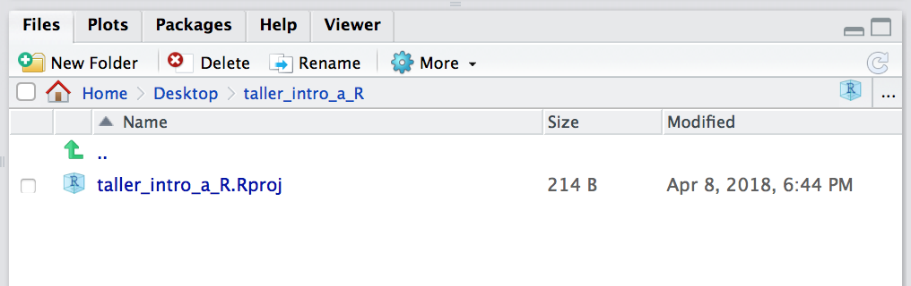
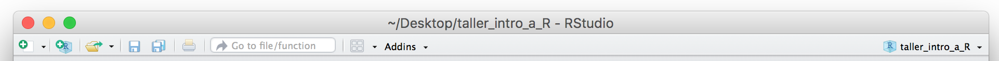
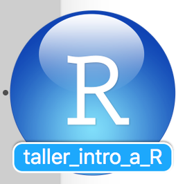

{width=1000}

### ¿Qué es R?

- Lenguaje de programación para el procesamiento y análisis estadístico de datos
- Software Libre
- Código abierto
- Sintaxis Básica: R base 
- Funciona en casi todas las plataformas (Mac, Windows, Linux).
- Promueve la investigación reproducible.
- Se puede combinar con otras herramientas.
- Sintaxis incremental[^1]: El lenguaje se va ampliando por aportes de Universidades, investigadores/as, usuarios/as y empresas privadas, organizados en librerías (o paquetes). Solo en CRAN hay cerca de 20.000 paquetes.
- Comunidad web muy grande para realizar preguntas y despejar dudas. Por ejemplo, en el caso de Buenos Aires contamos con [R-Ladies Buenos Aires](https://www.meetup.com/es-ES/rladies-buenos-aires/) y [RenBaires](https://www.meetup.com/es-ES/renbaires/).
- Gráficos con calidad de publicación

[^1]: Más allá de los comandos elementales, comandos más sofisticados tienen muchas versiones, y algunas quedan en desuso en el tiempo.

{width=1000}

### ¿Cómo entender R?
Hay una sesión de R corriendo. La consola de R es la interfaz entre R y nosotros.
En la sesión hay objetos. Todo en R es un objeto: vectores, tablas, funciones, etc.
Operamos aplicando funciones a los objetos y creando nuevos objetos.


{width=1000}

### Instalación de R y RStudio

En este curso utilizaremos R a través del IDE RStudio. ¿Qué es un IDE? IDE es el acrónimo de *Integrated Development Environment* (*Entorno de Desarrollo Integrado*). Esto quiere decir que RStudio es una aplicación que nos entrega herramientas para hacer más fácil el desarrollo de proyectos usando R. _RStudio_ es uno de los _IDE_ más cómodos y más utilzados para programar en _R_.

Tanto R, como RStudio son gratuitos. Para poder instalarlos hay que siguir los siguientes pasos:

- Descarga R desde https://cran.r-project.org/. Debes elegir la opción que corresponda, según tu sistema operativo.
- Instala R en tu computador, tal como lo haces con cualquier programa. 
- Una vez que R ha quedado correctamente instalado, descarga RStudio desde https://www.rstudio.com/products/rstudio/download/. Elige la primera opción, es decir, "RStudio Desktop Open Source License" (gratuita). 
- Instala RStudio en tu computador, tal como lo haces con cualquier programa. 

Si quedó todo bien instalado, cuando abras RStudio deberías ver algo así:

{width=1000}

IMPORTANTE: Si te aparece algún error durante este proceso, lo más probabable es que sea por alguna configuración de tu sistema operativo. En ese caso, la mejor manera de buscar una solución es copiar el error que arroja R, pegarlo en tu motor de búsqueda favorito y ver cómo alguien que se enfrentó a eso antes lo resolvió. 


#### Actualización de R y RStudio

En este tutorial usaremos al última versión de R y RStudio, así que si tienes instalada una versión previa, puede que algunas cosas se vean un poco distintas. Por ese motivo, les recomendamos proceder con la actualización siguiendo estos pasos:

Verificación de la versión R
Abrir RStudio. En la parte superior de la consola se va a ver la información de la sesión. La primera linea dice que versión de R estás usando. Si ya tenes abierto RStudio y lo estas utilizand, podes acceder a la versión escribiendo en la consola R.version.string. En caso de no tener la versión _R version 4.0.4_ instalada continuar con los pasos siguientes:

**Windows**
Para actualizar R en Windows vamos a utilizar el paquete _installr_ (solo funciona en Windows).

1- Escribir en la consola install.packages("installr") y luego library(installr)
2- Escribir en la consola la función updateR(). Esto comenzara a correr un proceso de búsqueda de la última versión de R, descargarla, correr la instalación, borrar la instalación previa, copiar y actualizar viejos paquetes a la nueva versión de R.
3- Desde RStudio ir a Help > Check for Updates para instalar la versión más nueva de RStudio.


**Mac**
Para Mac, simplemente hay que bajar e instalar la nueva versión de R. Cuando reseteas RStudio, va a usar la versión actualizada de R.

1- La descarga la podes hacer directamente desde este link: https://cloud.r-project.org/bin/macosx/ y luego seleccionando la opción “R-4.0.4.pkg”. 
2- Cuando termina de bajar el archivo, con doble click comienza la instalación. Deberias hacer click en "Siguiente" a cada paso para finalizar la instalación.
3- Desde RStudio ir a Help > Check for Updates para instalar la versión más nueva de RStudio.


Para actualizar los paquetes hay que ir a Tools > Check for Package Updates. Si hay actualizaciones disponibles, seleccionar las deseadas y cliquear en Install Updates.


Ahora si estamos listos para hacer Data Science con R. Pero primero vamos a repasar todo los componentes que contiene RStudio.


{width=1000}

¿Para qué sirven estos paneles? Comentemos primero el panel de abajo a la derecha. Si te fijas, el panel tiene varias ventanas: 

* __Files__ muestra el directorio (la carpeta) en la que te encuentras actualmente. 

* __Plots__ es el lugar donde aparecerán los gráficos que vayas creando.

* __Packages__ muestra la lista de paquetes que tienes instalados en tu computador. Si recorres el panel verás que algunos tiene una marca al lado izquierdo. Eso quiere decir que el paquete está activo en ese momento (ya veremos cómo hacer eso). Solo los paquetes vinculados a R base se activan al abrir RStudio. 

* __Help__, como su nombre lo indica, es la pestaña en la que podemos encontrar ayuda. Si buscamos el nombre de un paquete o de una función, RStudio nos remitirá a la documentación asociada. 

* __Viewer__ es el panel para ver contenido web generado por algún paquete de R (gráficos para la web o aplicaciones interactivas). Por el momento no lo utilizaremos. 

El panel de arriba a la derecha, por su parte, contiene el historial de funciones que hemos ejecutado (_History_), la opción para generar conexiones a bases de datos externas (_Connections_) y el _Environment_. Este último panel es muy importante y entender lo que nos muestra es fundamental para comprender cómo funciona R. 

Por ahora está vacío porque no hemos creado ningún objeto o variable, pero cuando creemos alguno es aquí donde aparecerá. Ya volveremos a hablar sobre este panel cuando comenzemos a trabajar con datos. 

Hay un cuarto panel (que probablemente todavía no te aparece)  y que es el que utilizamos para escribir el código que queremos que R ejecute, es decir, el panel para nuestro _script_. Para crear un nuevo script podemos:
* ir a File > New File > R Script
* ocupar el atajo de teclado `comando` + `shift` + `n` (Mac) o `control` + `shift` + `n` (Linux / Windows)
* o seleccionar la opción desde la barra superior de la ventana:

{width=1000}

¡Ahora ya están los cuatro paneles!

NOTA: si alguna vez has utilizado Git o Github, lo que diré a continuación tendrá algo de sentido. Si no, puedes omitir este comentario y seguir a la sección siguiente. 
Si te fijas, en el panel en que está la consola hay una segunda pestaña: el/la Terminal. Esto es muy útil, ya que, por ejemplo, si tu proyecto lo tienes alojado en Github, no tienes que salir de R para hacer commit a los cambios que has hecho: puedes hacerlo directamente desde RStudio. 

### Lógica sintáctica.

#### Definición de objetos
Los __Objetos/Elementos__ constituyen la categoría esencial del R. De hecho, todo en R es un objeto, y se almacena con un nombre específico que **no debe poseer espacios**. Un número, un vector, una función, la progresión de letras del abecedario, una base de datos, un gráfico, constituyen para R objetos de distinto tipo. Los objetos que vamos creando a medida que trabajamos pueden visualizarse en el panel derecho superior de la pantalla (el _Environment_). 

El operador __```<-```__ (__Alt + Guión__) sirve para definir un objeto.  __A la izquierda__ del __```<-```__ debe ubicarse el nombre que tomará el elemento a crear. __Del lado derecho__ debe ir la definición del mismo.


```{r}
A <- 1
```

Por ejemplo, podemos crear el elemento __A__, cuyo valor será 1. Para esto, debemos _correr_ el código presionando __Ctrl + Enter__, con el cursor ubicado en cualquier parte de la línea. Al definir un elemento, el mismo queda guardado en el ambiente del programa, y podrá ser utilizado posteriormente para observar su contenido o para realizar una operación con el mismo.

```{r}
A 
A+6
```

Al correr una linea con el nombre del objeto, la consola del programa nos muestra su contenido. Entre corchetes observamos el número de orden del elemento en cuestión. Si corremos una operación, la consola nos muestra el resultado de la misma.

El operador __```=```__ es __equivalente__ a __```<-```__, pero en la práctica no se utiliza para la definición de objetos.   

```{r}
B = 2
B
```

__```<-```__ es un operador __Unidireccional__, es decir que:     
```A <- B``` implica que __A__ va tomar como valor el contenido del objeto __B__, y no al revés.

```{r}
A <- B
A      # Ahora A toma el valor de B, y B continúa conservando el mismo valor
B
```


### R base

Con _R base_ nos referimos a los comandos básicos que vienen incorporados en el R, sin necesidad de cargar librerías. 

#### Operadores lógicos: 

- $>$ (mayor a-)
- $>=$ (mayor o igual a-)
- $<$ (menor a-)
- $<=$ (menor o igual a-)
- $==$ (igual a-)
- $!=$ (distinto a-)

```{r}
# Redefinimos los valores A y B
A <- 10
B <- 20

# Realizamos comparaciones lógicas
A >  B
A >= B
A <  B
A <= B
A == B
A != B

C <- A != B
C
```

Como muestra el último ejemplo, el resultado de una operación lógica puede almacenarse como el valor de un objeto.

#### Operadores aritméticos:

```{r}
#suma
A <- 5+6
A
#Resta
B <- 6-8
B
#cociente
C <- 6/2.5
C
#multiplicacion
D <- 6*2.5
D
```

#### Funciones:
Las funciones son series de procedimientos estandarizados, que toman como imput determinados argumentos a fijar por el usuario, y devuelven un resultado acorde a la aplicación de dichos procedimientos. Su lógica de funcionamiento es:   
```funcion(argumento1 = arg1, argumento2 = arg2)```      

A lo largo del curso iremos viendo numerosas funciones, según lo requieran los distintos ejercicios. Sin embargo, veamos ahora algunos ejemplos para comprender su funcionamiento:    

- paste() : concatena una serie de caracteres, pudiendo indicarse cómo separar a cada uno de ellos        
- paste0(): concatena una serie de caracteres sin separar
- sum(): suma de todos los elementos de un vector   
- mean() promedio aritmético de todos los elementos de un vector   

```{r}
paste("Pega", "estas", 4, "palabras", sep = " ")

#Puedo concatenar caracteres almacenados en objetos
paste(A, B, C, sep = "**")

# Paste0 pega los caracteres sin separador
paste0(A, B, C)

1:5

sum(1:5)

mean(1:5, na.rm = TRUE)
```


#### Caracteres especiales

- R es sensible a mayúsculas y minúsculas, tanto para los nombres de las variables, como para las funciones y parámetros.
- Los __espacios en blanco__ y los __carriage return__ (_enter_) no son considerados por el lenguaje. Los podemos aprovechar para emprolijar el código y que la lectura sea más simple[^2].

[^2]: veremos que existen ciertas excepciones con algunos paquetes más adelante. 

- El __numeral__ ```#``` se utiliza para hacer comentarios. Todo lo que se escribe después del # no es interpretado por R. Se debe utilizar un # por cada línea de código que se desea anular

- Los __corchetes__ ```[]``` se utilizan para acceder a un objeto:
    - en un vector[n° orden]
    - en una tabla[fila, columna]
    - en una lista[n° elemento]   
    
- el signo __$__ también es un método de acceso. Particularmente, en los dataframes, nos permitira acceder a una determinada columna de una tabla

- Los __paréntesis__```()``` se utilizan en las funciones para definir los parámetros.

- Las __comas__ ```, ```  se utilizan para separar los parametros al interior de una función. 

### Objetos:    
Existe una gran cantidad de objetos distintos en R, en lo que resepcta al curso trabajaremos principalmente con 3 de ellos:

- Valores
- Vectores
- Data Frames
- Listas

#### Valores
Los valores y vectores pueden ser a su vez de distintas _clases_:   

__Numeric__     

```{r}
A <-  1
class(A)
```


__Character__
```{r}
A <-  paste('Soy', 'una', 'concatenación', 'de', 'caracteres', sep = " ")
A
class(A)
```


__Factor__
```{r}
A <- factor("Soy un factor, con niveles fijos")
class(A)
```

La diferencia entre un _character_ y un _factor_ es que el último tiene solo algunos valores permitidos (levels), con un orden interno predefinido (el cual, por ejemplo, se respetará a la hora de realizar un gráfico)  


#### Vectores

Para crear un __vector__ utilizamos el comando ```c()```, de combinar.

```{r}
C <- c(1, 3, 4)
C
```

Podemos sumarle 2 a cada elemento del __vector__ anterior

```{r}
C <- C + 2
C
```

O sumarle 1 al primer elemento, 2 al segundo, y 3 al tercer elemento del __vector__ anterior
```{r}
D <- C + 1:3 # esto es equivalente a hacer 3+1, 5+2, 6+9 
D
```

```1:3``` significa que queremos todos los números enteros desde 1 hasta 3. 

Podemos crear un __vector__ que contenga las palabras: "Carlos", "Federico", "Pedro"
```{r}
E <- c("Carlos", "Federico", "Pedro")
E
```

Para acceder a algún elemento del vector, podemos buscarlo por su número de orden, entre ```[ ]```

```{r}
E[2]
```

Si nos interesa almacenar dicho valor, al buscarlo lo asignamos a un nuevo objeto, dándole el nombre que deseemos

```{r}
elemento2 <- E[2]
```

```{r}
elemento2
```

Para __borrar__ un objeto del ambiente de trabajo, utilizamos el comando _```rm()```_

```{r error=TRUE}
rm(elemento2)
elemento2
```

También podemos cambiar el texto del segundo elemento de E, por el texto "Pablo"

```{r}
E[2] <- "Pablo"
E
```

### Data Frames

Un Data Frame es una tabla de datos, donde cada columna representa una variable, y cada fila una observación.

Este objeto suele ser central en el proceso de trabajo, y suele ser la forma en que se cargan datos externos para trabajar en el ambiente de R, y en que se exportan los resultados de nuestros trabajo.  

También se puede crear como la combinación de N vectores de igual tamaño. Por ejemplo, tomamos algunos valores del [PAS-Bolsa de Cereales](https://www.bolsadecereales.com/download/informes/documento2/121).

```{r}
RINDE  <- c(3.2,   2.18,   6,
             3.12, 3.35, 8.31,
             2.92, 2.96, 8.16)

CAMPANA  <-  c("2017/18","2017/18","2017/18",
             "2018/19","2018/19","2018/19",
             "2019/20","2019/20","2019/20")

CULTIVO  <-  c("Trigo","Soja","Maiz",
             "Trigo","Soja","Maiz",
             "Trigo","Soja","Maiz")

Datos <- data.frame(RINDE, CAMPANA, CULTIVO)
Datos
```

Tal como en un __vector__ se ubica a los elementos mediante ```[ ]```, en un __dataframe__ se obtienen sus elementos de la forma __```[fila, columna]```__.

Otra opción es especificar la columna, mediante el operador __```$```__, y luego seleccionar dentro de esa columna el registro deseado mediante el número de orden.

```{r}
Datos$CAMPANA
Datos[3,2]
Datos$CAMPANA[3]
```

¿que pasa si hacemos ```Datos$CAMPANA[3,2]``` ?

```{r error=TRUE}
Datos$CAMPANA[3,2]
```

Nótese que el último comando tiene un número incorrecto de dimensiones, porque estamos refiriendonos 2 veces a la columna CAMPANA.    

Acorde a lo visto anteriormente, el acceso a los __dataframes__ mediante  ```[ ]``` puede utilizarse para realizar filtros sobre la base, especificando una condición para las filas. Por ejemplo, puedo utilizar los  ```[ ]``` para conservar del __dataframe__ ```Datos ```  unicamente los registros de la campaña _2017/18_:

```{r error=TRUE}
Datos[Datos$CAMPANA=="2017/18",]
```

La lógica del paso anterior sería: Accedo al dataframe ```Datos```, pidiendo únicamente conservar las filas (por eso la condición se ubica a la _izquierda_ de la  ```, ```) que cumplan el requisito de pertenecer a la categoría __"2017/18"__ de la variable __CAMPANA__.    

Aún más, podría aplicar el filtro y al mismo tiempo identificar una variable de interés para luego realizar un cálculo sobre aquella. Por ejemplo, podría calcular la media de los rindes en CAMPANA 2017/18. 

```{r error=TRUE}
###Por separado
rindes_17_18 <- Datos$RINDE[Datos$CAMPANA=="2017/18"]
rindes_17_18
```

```{r error=TRUE}
mean(rindes_17_18)
```

```{r error=TRUE}
### Todo junto
mean(Datos$RINDE[Datos$CAMPANA=="2017/18"])
```

La lógica de esta sintaxis sería: "Me quedo con la variable __RINDE__, cuando la variable CAMPANA sea igual a __"2017/18"__, luego calculo la media de dichos valores". Es como si se estuviera leyendo desde el interior para afuera.

### Listas

Contienen una concatenación de objetos de cualquier tipo. Así como un vector contiene valores, un dataframe contiene vectores, una lista puede contener dataframes, pero también vectores, o valores, y _todo ello a la vez_.

```{r}
superlista <- list(A,B,C,D,E,CAMPANA, DF = Datos, RINDE, CULTIVO)
superlista
```

Para acceder un elemento de una lista, podemos utilizar el operador __```$```__, que se puede usar a su vez de forma iterativa. 

```{r}
superlista$DF$CAMPANA[2]
```

### Ambientes de trabajo

Hay algunas cosas que tenemos que tener en cuenta respecto del orden del ambiente en el que trabajamos:

- Working Directory: Es el directorio de trabajo. Pueden ver el suyo con `getwd()`, es *hacia donde apunta el código*, por ejemplo, si quieren leer un archivo, la ruta del archivo tiene que estar explicitada como el recorrido desde el Working Directory. En caso de querer *setear* otra ruta se puede utilizar el comando `setwd()`.
- Environment: Esto engloba tanto la información que tenemos cargada en *Data* y *Values*, como las librerías que tenemos cargadas mientras trabajamos. 

Es importante que mantengamos bien delimitadas estas cosas entre diferentes trabajos, sino:

1. El directorio queda referido a un lugar específico en nuestra computadora. 
  - Si se lo compartimos a otro **se rompe**
  - Si cambiamos de computadora **se rompe**
  - Si lo cambiamos de lugar **se rompe**
  - Si primero abrimos otro script **se rompe**
2. Tenemos mezclados resultados de diferentes trabajos:
  - Nunca sabemos si esa variable/tabla/lista se creo en ese script y no otro
  - Perdemos espacio de la memoria
  - No estamos seguros de que el script cargue todas las librerías que necesita

Rstudio tiene una herramienta muy útil de trabajo que son los **proyectos**. Estos permiten mantener un ambiente de trabajo delimitado por cada uno de nuestros trabajos. Es decir:

- El directorio de trabajo se refiere a donde esta ubicado el archivo .Rproj
- El Environment es específico de nuestro proyecto.

Un proyecto no es un sólo script, sino toda una carpeta de trabajo. 

{width=1000}

¿Cómo crear un proyecto? Puedes hacerlo desde el menú File > New Proyect. 

Lo primero que nos pregunta es si queremos crearlo en una carpeta nueva o en una ya existente. Elegiremos esta vez una carpeta nueva, así que seleccionaremos _New Directory_. 

La siguiente pregunta es qué tipo de proyecto queremos crear. En esta ocasión, elegiremos la primera: _New Project_.

Finalmente, le damos un nombre al proyecto y decidimos en qué parte de nuestro computador queremos que viva la carpeta que lo contiene. 

Luego de apretar _Create Project_, RStudio se reinicia y se producen algunos cambios. El panel _Files_ (abajo a la derecha) ahora nos muestra la carpeta de nuestro proyecto y el único archivo que hay en ella por ahora. Ese es el archivo mágico que mantiene unido todo lo que hay dentro de la carpeta. Cuando queramos volver a trabajar en nuestro proyecto, solo tenemos que abrir ese archivo. 

{width=1000}

Otro cambio que ocurre es que en la barra superior aparece ahora la ruta de la carpeta de nuestro projecto. 

{width=1000}

Por último, algo cambia en el ícono de R: aparece el nombre que le dimos a nuestro proyecto:
{width=1000}

Esto último es muy muy muy útil: RStudio ejecuta sesiones independientes de R para cada proyecto. Es decir, si tuvieras otro proyecto abierto te aparecería otro ícono, con su respectivo nombre. Esto nos permite trabajar en dos proyectos en paralelo sin que se nos mezclen los objetos del entorno, el código, los archivos, etc. Cada cosa en su lugar.


### Tipos de archivos de R

- __Script__: Es un archivo de texto plano, donde podemos poner el código que utilizamos para preservarlo.
- __Rnotebook__: También sirve para guardar el código, pero a diferencia de los scripts, se puede compilar, e intercalar código con resultados (este archivo es un rnotebook).
- __Shiny Web App__: Shiny es un paquete de R que facilita la creación de aplicaciones web interactivas directamente desde R. Permite a quienes no son versados en diseño web construir rápidamente una página reactiva para explorar la información.
- __Rproject__: Es un archivo que define la metadata del proyecto.
- __RDS y Rdata__: Dos formatos de archivos propios de R para guardar datos. 
